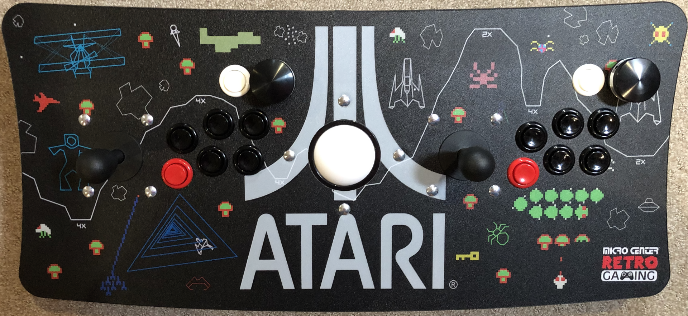
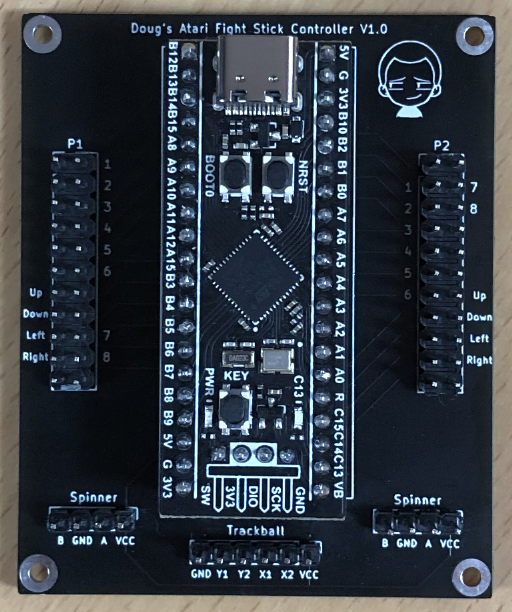

# Imperium

Imperium aims to be a flexible low latency all-in-one arcade USB adaptor.

The project started out as a replacement controller for the Micro Center Atari Fight Stick but hopefully anyone looking to integrate arcade controls with MiSTer (or mame) will find it useful. The project currently targets STM32 microcontrollers but can easily be adapted to work with others. 

As for the project name I looked up the Latin word for "control" since I was dealing with controls. If you have a better suggestion, let me know.

# Features

If your microcontroller has enough pins Imperium can support the following:

- Up to 64 digital inputs (1 input per button, 4 inputs per joystick)

- Up to 8 rotary encoders (1 encoder per spinner, 2 encoders per trackball)

- Multiple control mappings. Allows per game controls.

# How it works

The Arduino code grabs the state of all switches and encoders. It packs the data into a raw HID report and sends it to a user space Linux driver.

The user space Linux driver on start up loads a JSON config file. The config file defines the input devices to create, how they are grouped, and how the data from the raw HID report should be split between the input devices. The input devices are created, and the driver waits for data. Once received, the data is splt and sent to the appropriate input devices.

# Hardware configuration

There is a hardware config include file for each supported microcontroller. That file needs to be modified for your setup.

This is where the number of encoders (and their ppr) and the inputs for each port is specified.

The inputs for a port are packed together in the order you define them. Each port's data is then packed together with the other port's data alphabetically (e.g. port A, port B, etc.).

For example if your hardware config had the following definitions:

```
#define NUM_A_INPUTS 3
const int8_t inputPinA[NUM_A_INPUTS] = {PA0, PA9, PA10};
const int16_t inputPinMaskA[NUM_A_INPUTS] = {1<<0, 1<<9, 1<<10};

#define NUM_B_INPUTS 1
const int8_t inputPinB[NUM_B_INPUTS] = {PB0};
const int16_t inputPinMaskB[NUM_B_INPUTS] = {1<<0};

#define NUM_C_INPUTS 2
const int8_t inputPinC[NUM_C_INPUTS] = {PC14, PC13};
const int16_t inputPinMaskC[NUM_C_INPUTS] = {1<<14, 1<<13};
```

The bit array sent to the linux driver would look like this:

PA0, PA9, PA10, PB0, PC14, PC13

This order is important to note. You will need it to properly map an input on the microcontroller to a device input in the user space Linux driver.

**Warning:** PA0 and PB5 on the STM32F411 are NOT 5v tolerant. Do NOT use them as rotary encoder inputs. They are 5v tolerant on the STM32F401.

# Control mapping

The JSON format is as follows:

- Overall controller config
   - Change controller mapping button
   - One or more device groups
     - One or more devices
       - Name
       - Product
       - Vendor
       - One or more inputs
         - Type
         - Code
         - Value
         - Min
         - Max
   - Always active devices 
     - Zero or more device
       - Name
       - Product
       - Vendor
       - One or more inputs
         - Type
         - Code
         - Value
         - Min
         - Max

When defining inputs:

**Type** = The type of the Linux input (EV_KEY, EV_REL or EV_ABS)

**Code** = The code of the Linux input (BTN_A, REL_DIAL, ABS_WHEEL, etc.)

**Value** = Depending on the **Type** it is either:
- If **Type** is EV_KEY
  - **Value** is the position received from the microcontroller (0-63)
- If **Type** is EV_REL or EV_ABS
  - **Value** is the index of the encoder (0-7)
    
**Min** = The minimum value. Only applicable if the Type is EV_ABS.

**Max** = The minimum value. Only applicable if the Type is EV_ABS.

**See the included imperium.json for an example mapping.**

# Compiling

Download and extract the Imperium codebase.

**Arduino**

Install [Arduino for the STM32](https://github.com/stm32duino/Arduino_Core_STM32). Follow their install directions.

Install my fork of "[TinyUSB for Arduino](https://github.com/ddstevens/Adafruit_TinyUSB_Arduino)". Make sure to update your local Arduino install per the readme. 

Open the Imperium Arduino project (imperium/mcu/imperium).

Update the Arduino IDE settings. For the WeAct Studio STM32F411 (adjust for your variant):

- Board: "Generic STM32F4 series"
- Board part number: "BlackPill F411CE"
- U(S)ART support: "Enabled (no generic 'Serial')"
- USB support (if available): "CDC (no generic 'Serial')"
- USB speed (if available): "Low/Full Speed"
- Optimize: "Fast (-O1)"
- Debug symbols: "None"
- C Runtime Library: "Newlib Nano (default)"

Build / Upload to your device.

**Linux**

Install the cross compiler (gcc-arm-10.2-2020.11-x86_64-arm-none-linux-gnueabihf). Update the Makefile to point to where you installed it.

```
cd imperium/linux
make
```

# Installation

**Make an "Imperium" directory under /media/fat:**
```
ssh root@your-mister-ip
mkdir /media/fat/Imperium
```

**Copy the imperium binary and json to your newly created Imperium directory:**
```
scp imperium root@your-mister-ip:/media/fat/Imperium
scp imperium.json root@your-mister-ip:/media/fat/Imperium
```

**Copy imperium.rules into /etc/udev/rules.d:**
```
scp imperium.rules root@your-mister-ip:/etc/udev/rules.d
```

**Modify /media/fat/linux/user-startup.sh to start imperium:**
```
scp user-startup.sh root@your-mister-ip:/media/fat/linux/user-startup.sh
```

**Restart MiSTer**

Restart MiSTer and you should be up and running.

# Operation

To switch the active controller mapping press the "change controller mapping button" you defined in the config JSON. Imperium will advance to next mapping, starting over at the beginning after the last mapping.

# PCB

Here is picture of the almost finished PCB. Sadly I found out too late I couldn't use the pin P2's Button 7 is tied to. After I correct the KiCad files, I'll add them to the project.



# My setup

Fight stick: [Micro Center's Atari Arcade Fightstick with Trackball](https://www.microcenter.com/product/623128/atari-arcade-fightstick-with-trackball-usb-dual-joystick-2-player-game-controller)

Spinners: [UltiMarc SpinTrak Rotary Control](https://www.ultimarc.com/trackballs-and-spinners/spinners/spintrak)

Trackball: [SuzoHapp High Lip Trackball](https://na.suzohapp.com/products/trackballs/56-0100-11HL)

MCU: [WeAct Studio STM32F411CE](https://github.com/WeActTC/MiniSTM32F4x1)

# History

The story of this project should give some insight into why things ended up they way they are.

When MiSTer's Atari 7800 core was updated with spinner support I thought it would be a fun project to add spinners to my Micro Center Atari Fight Stick.

The trackball that comes with the Micro Center fight stick had its own embedded controller. To minimize the number of USB cables I replaced the 2.5" trackball with a SuzoHapp 3" high lip trackball (56-0100-11HL). It is almost a perfect fit. The bolt pattern is identical, but I had to widen the ball opening by maybe a millimeter.

The plan was to use 2 Arduino Pro Micros. One for the P1 controls (joystick, buttons, spinner and trackball) and the other for the P2 controls (joystick, buttons and spinner). I looked at [Sorg's paddle adaptor](https://github.com/MiSTer-devel/Retro-Controllers-USB-MiSTer) and [Niels3RT's SpinJoy adaptor](https://github.com/Niels3RT/SpinJoy) felt I understood them and started to code.

I discovered not all the Arduino Pro Micro's GPIO pins can be interruptible. Because of this limitation the Arduino Pro Micro doesn't have enough interruptible pins to support a spinner and trackball at the same time. I could have used three Arduino Pro Micros, but it felt excessive. So I started looking for a single microcontroller solution.

After much searching I landed on the STM32F401 and STM32F411. They seemed a perfect fit. They are inexpensive, have Arduino support, plenty of interruptible pins, and the pins are even 5v tolerant.

I thought I was almost done. The software was written. I just needed to assign the pins. Unfortunately the HID class used by Sorg and Niels3RT isn't implemented in the Arduino core for the STM32. It was well beyond my understanding to try to add it. The closest library I could find was "TinyUSB for Arduino", but it didn't support the STM32 either.

Luckily porting this library was much easier. I followed their porting guide and did the bare minimum to add basic STM32 support.

After the Arduino code was updated to use the new library I had a working adaptor that supported 2 joysticks, 15 buttons, 2 spinners, and trackball. The device appeared as a composite HID device made up of 2x gamepads and 1x mouse. I was thrilled until I measured the latency.

The problem is you can't send multiple HID reports in a single USB update; they must be sent serially. If there are changes for all three devices the best case latency goes from 1ms to 3ms. Since the gold standard seems to be 1ms or less I decided to scrap everything and change my approach.

The adaptor is no longer a composite HID device. Instead, it consists of two parts. A raw HID device, and a user space Linux driver. All input data is bundled in a single raw HID report and sent. When the user space linux driver receives the raw HID report it splits it into multiple input devices.

This solves the latency issue and allows for quite a bit of flexibility.

# Future

There are other STM32 boards that have a bunch of GPIO pins > 70. Support for the STM32F743 should come soon.

# Credits

[Niels3RT's SpinJoy adaptor](https://github.com/Niels3RT/SpinJoy) for a simple but effective debounce algorithm.

[Sorg's paddle adaptor](https://github.com/MiSTer-devel/Retro-Controllers-USB-MiSTer) for being the basis of Niels3RT's project and MiSTer.
